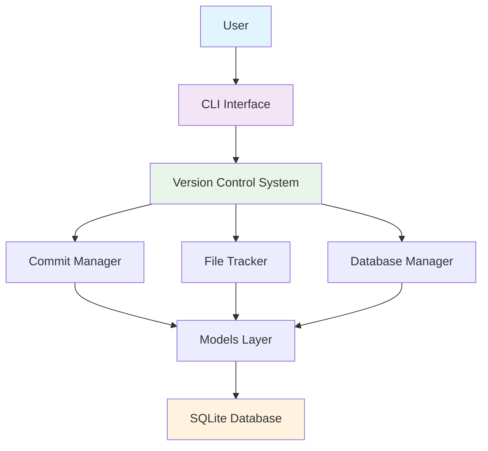
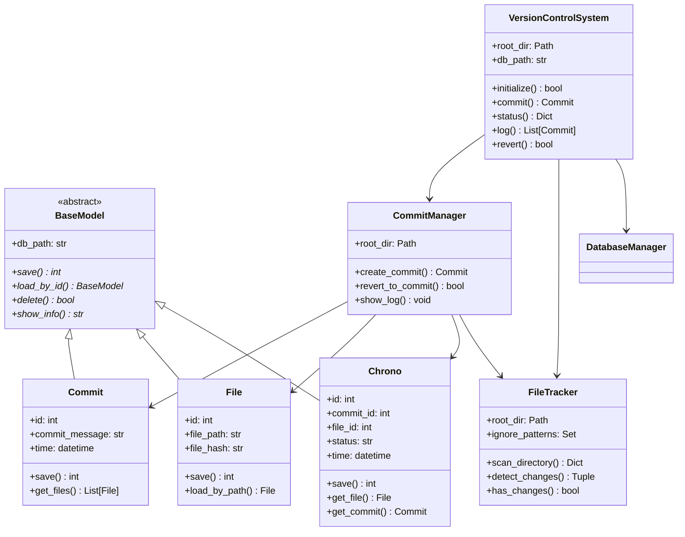
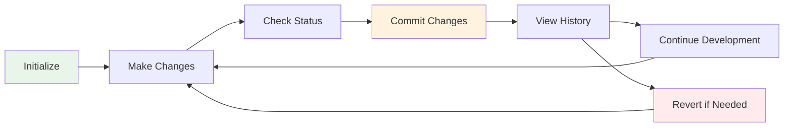
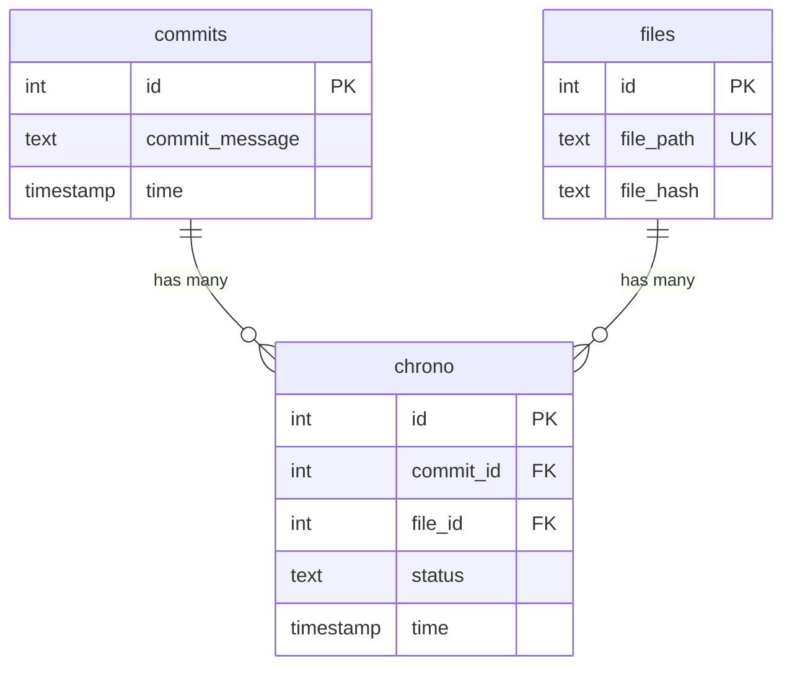
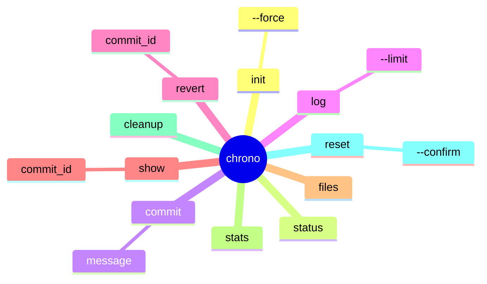
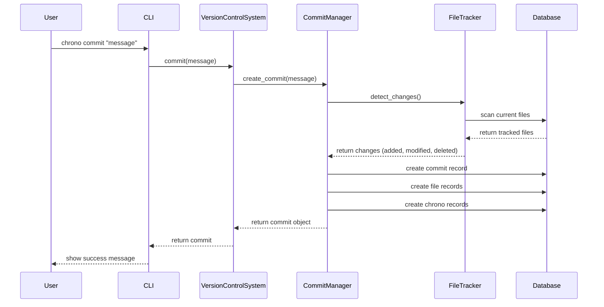
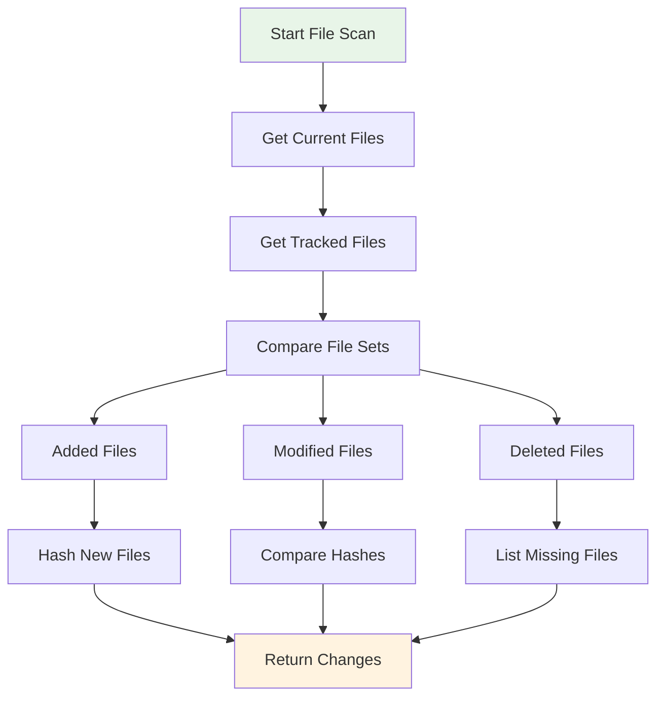
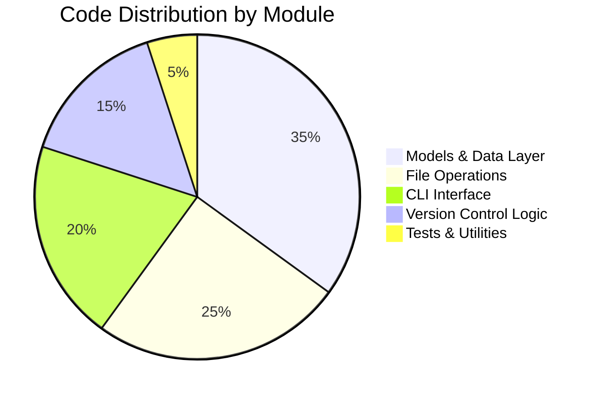

# ChronoTrack 🕰️

> A lightweight, object-oriented version control system for personal use, built with Python and SQLite.

[](https://python.org)
[](LICENSE)
[]()

## 📋 Table of Contents

- [Overview](#overview)
- [Architecture](#architecture)
- [Features](#features)
- [Installation](#installation)
- [Usage](#usage)
- [Project Structure](#project-structure)
- [Class Documentation](#class-documentation)
- [Database Schema](#database-schema)
- [CLI Commands](#cli-commands)
- [Development](#development)

## 🎯 Overview

ChronoTrack is a minimal, CLI-based version control system designed for personal projects and learning purposes. It implements core version control concepts like commits, file tracking, and history management using object-oriented principles and SQLite for data persistence.



## 🏗️ Architecture

ChronoTrack follows a layered architecture implementing several design patterns:

### 🎨 Design Patterns Used

- **Facade Pattern**: `VersionControlSystem` provides a unified interface
- **Model Pattern**: Data models with ORM-like functionality
- **Template Method**: Abstract `BaseModel` class
- **Strategy Pattern**: Different file tracking strategies



## ✨ Features

### Core Functionality
- 📁 **File Tracking**: Automatic detection of file changes using SHA256 hashing
- 💾 **Commits**: Create snapshots of your project state
- 📜 **History**: View commit history with detailed change information
- ⏪ **Revert**: Roll back to any previous commit
- 🔍 **Status**: Check current working directory status
- 🗃️ **Backup**: Automatic file backups for safe operations

### Advanced Features
- 🚫 **Smart Ignoring**: Configurable ignore patterns for common files
- 📊 **Statistics**: Repository statistics and insights
- 🧹 **Cleanup**: Database optimization and cleanup utilities
- 🔄 **Recovery**: Emergency backup system for data safety

## 🚀 Installation

### Prerequisites
- Python 3.10 or higher
- pip package manager

### Install from Source

```bash
# Clone the repository
git clone https://github.com/chronotrack/chronotrack.git
cd chronotrack

# Install in development mode
pip install -e .

# Or install dependencies manually
pip install -r requirements.txt
```

### Verify Installation

```bash
chrono --help
```

## � Usage

### Quick Start

```bash
# Initialize a new repository
chrono init

# Check status
chrono status

# Create your first commit
echo "Hello ChronoTrack!" > hello.txt
chrono commit "Add hello file"

# View history
chrono log

# Show commit details
chrono show 1
```

### Common Workflows



## 📂 Project Structure

```
chrono-track/
├── 📄 LICENSE                    # MIT License
├── 📄 README.md                  # This file
├── 📄 pyproject.toml             # Project configuration
├── 📄 requirements.txt           # Runtime dependencies
├── 📄 requirements-dev.txt       # Development dependencies
├── 📄 uv.lock                    # Dependency lock file
├── 📁 src/chronotrack/           # Main source code
│   ├── 📄 __init__.py           # Package initialization
│   ├── 📄 cli.py                # Command-line interface
│   ├── 📄 version_control.py    # Main facade class
│   ├── 📄 commit_manager.py     # Commit operations
│   ├── 📄 file_tracker.py       # File tracking logic
│   ├── 📄 models.py             # Data models
│   └── 📄 base_model.py         # Abstract base model
└── 📁 tests/                     # Test suite
    ├── 📄 __init__.py
    └── 📄 test_chronotrack.py
```

## 📚 Class Documentation

### 🏛️ Core Classes

#### `VersionControlSystem` (Facade)
**Purpose**: Main entry point providing a unified interface to all ChronoTrack operations.

```python
class VersionControlSystem:
    """Facade class for all version control operations."""
```

**Key Methods**:
- `initialize(force=False) -> bool`: Initialize repository
- `commit(message: str) -> Optional[Commit]`: Create new commit
- `status() -> Dict`: Get repository status
- `log(limit=10) -> List[Commit]`: Show commit history
- `revert(commit_id: int) -> bool`: Revert to specific commit
- `show_commit(commit_id: int) -> Optional[Dict]`: Show commit details

#### `BaseModel` (Abstract Base Class)
**Purpose**: Provides common database operations for all model classes.

```python
class BaseModel(ABC):
    """Abstract base class implementing ORM-like functionality."""
```

**Key Methods**:
- `save() -> int`: Save model to database (abstract)
- `load_by_id(model_id: int) -> Optional[BaseModel]`: Load by ID (abstract)
- `delete() -> bool`: Delete from database (abstract)
- `show_info() -> str`: String representation (abstract)

### 📊 Data Models

#### `Commit` Model
**Purpose**: Represents a commit in the version control system.

```python
class Commit(BaseModel):
    """Encapsulates commit data and operations."""
    
    # Attributes
    id: int                    # Unique commit identifier
    commit_message: str        # Commit description
    time: datetime            # Timestamp of commit creation
```

**Key Methods**:
- `save() -> int`: Persist commit to database
- `load_by_id(commit_id: int) -> Optional[Commit]`: Load specific commit
- `get_files() -> List[File]`: Get all files in this commit
- `get_all_commits() -> List[Commit]`: Class method to get all commits

#### `File` Model
**Purpose**: Represents a tracked file in the system.

```python
class File(BaseModel):
    """Encapsulates file data and operations."""
    
    # Attributes
    id: int                    # Unique file identifier
    file_path: str            # Relative path from repository root
    file_hash: str            # SHA256 hash of file content
```

**Key Methods**:
- `save() -> int`: Persist file to database
- `load_by_path(file_path: str) -> Optional[File]`: Load file by path
- `get_all_files() -> List[File]`: Class method to get all tracked files

#### `Chrono` Model (Junction Table)
**Purpose**: Links commits and files with change status information.

```python
class Chrono(BaseModel):
    """Represents commit-file relationships with status."""
    
    # Attributes
    id: int                    # Unique relationship identifier
    commit_id: int            # Reference to commit
    file_id: int              # Reference to file
    status: str               # Change type: 'added', 'modified', 'deleted'
    time: datetime            # Timestamp of change
```

**Key Methods**:
- `get_file() -> Optional[File]`: Get associated file
- `get_commit() -> Optional[Commit]`: Get associated commit
- `get_by_commit(commit_id: int) -> List[Chrono]`: Get all changes for commit

### 🔧 Manager Classes

#### `FileTracker`
**Purpose**: Handles file scanning, change detection, and hash computation.

```python
class FileTracker:
    """Implements file tracking logic with change detection."""
```

**Key Methods**:
- `scan_directory() -> Dict[str, str]`: Scan and hash all files
- `detect_changes() -> Tuple[Dict, Dict, List]`: Find added/modified/deleted files
- `has_changes() -> bool`: Check if any changes exist
- `get_status_summary() -> Dict`: Get detailed status information
- `_compute_file_hash(file_path: Path) -> str`: Generate SHA256 hash
- `_should_ignore(file_path: Path) -> bool`: Check ignore patterns

**Ignore Patterns**:
```python
ignore_patterns = {
    ".chrono", ".git", "__pycache__", "*.pyc", 
    ".DS_Store", "venv", "env", ".venv", ".env", 
    "dist", "build"
}
```

#### `CommitManager`
**Purpose**: Manages commit operations, logging, and revert functionality.

```python
class CommitManager:
    """Encapsulates commit-related business logic."""
```

**Key Methods**:
- `create_commit(message: str) -> Optional[Commit]`: Create new commit
- `revert_to_commit(commit_id: int) -> bool`: Revert to specific commit
- `show_log(limit: int)`: Display commit history
- `show_status() -> Dict`: Show current repository status
- `get_commit_history(limit: int) -> List[Commit]`: Get commit list
- `get_commit_details(commit_id: int) -> Optional[Dict]`: Get detailed commit info

#### `DatabaseManager`
**Purpose**: Handles database initialization and schema management.

```python
class DatabaseManager:
    """Manages database operations following single responsibility."""
```

**Key Methods**:
- `initialize_database()`: Create all necessary tables
- `reset_database()`: Drop and recreate all tables

## 🗃️ Database Schema

ChronoTrack uses SQLite with the following schema:



### Table Descriptions

#### `commits` Table
- **Purpose**: Stores commit information
- **Fields**:
  - `id`: Auto-incrementing primary key
  - `commit_message`: User-provided description
  - `time`: Timestamp of commit creation

#### `files` Table
- **Purpose**: Stores file information
- **Fields**:
  - `id`: Auto-incrementing primary key
  - `file_path`: Unique relative path from repository root
  - `file_hash`: SHA256 hash of file content

#### `chrono` Table (Junction)
- **Purpose**: Links commits to files with change status
- **Fields**:
  - `id`: Auto-incrementing primary key
  - `commit_id`: Foreign key to commits table
  - `file_id`: Foreign key to files table
  - `status`: Change type (`added`, `modified`, `deleted`)
  - `time`: Timestamp of the change

## 🖥️ CLI Commands

### Command Reference



### Detailed Command Documentation

| Command | Description | Arguments | Options |
|---------|-------------|-----------|---------|
| `init` | Initialize ChronoTrack repository | - | `--force`: Force reinitialize |
| `status` | Show current repository status | - | - |
| `commit` | Create a new commit | `message`: Commit message | - |
| `log` | Show commit history | - | `--limit N`: Show N commits |
| `revert` | Revert to specific commit | `commit_id`: Target commit | - |
| `show` | Show commit details | `commit_id`: Commit to display | - |
| `files` | List all tracked files | - | - |
| `stats` | Show repository statistics | - | - |
| `cleanup` | Clean and optimize repository | - | - |
| `reset` | Reset repository (dangerous!) | - | `--confirm`: Confirm operation |

### Usage Examples

```bash
# Repository lifecycle
chrono init                          # Initialize
chrono status                        # Check status
chrono commit "Initial commit"       # First commit
chrono log --limit 5                # Show recent commits
chrono show 1                       # Show commit details
chrono revert 1                     # Revert to commit 1

# File operations
chrono files                        # List tracked files
chrono stats                        # Repository statistics

# Maintenance
chrono cleanup                      # Optimize database
chrono reset --confirm             # Reset everything
```

## 🔄 Data Flow

### Commit Process Flow



### File Change Detection



## 🧪 Testing

Run the test suite:

```bash
# Run all tests
python -m pytest tests/

# Run with coverage
python -m pytest tests/ --cov=chronotrack

# Run specific test
python -m pytest tests/test_chronotrack.py::TestChronoTrack::test_initialization
```

## 🛠️ Development

### Setup Development Environment

```bash
# Clone and setup
git clone https://github.com/chronotrack/chronotrack.git
cd chronotrack

# Install development dependencies
pip install -r requirements-dev.txt

# Install in editable mode
pip install -e .
```

### Code Quality Tools

```bash
# Format code
black src/ tests/

# Lint code
flake8 src/ tests/

# Type checking
mypy src/
```

### Contributing

1. Fork the repository
2. Create a feature branch
3. Make your changes
4. Add tests for new functionality
5. Ensure all tests pass
6. Submit a pull request

## 📈 Statistics & Metrics

### Codebase Metrics



### Features Comparison

| Feature | ChronoTrack | Git | Benefits |
|---------|-------------|-----|----------|
| **Simplicity** | ✅ Minimal | ❌ Complex | Easy to understand |
| **Learning** | ✅ Educational | ❌ Advanced | Great for learning VCS |
| **Dependencies** | ✅ Python + SQLite | ❌ C + Many | Lightweight |
| **Personal Use** | ✅ Optimized | ⚠️ Overkill | Perfect for small projects |
| **File Tracking** | ✅ SHA256 | ✅ SHA1 | Secure hashing |

## 📝 License

This project is licensed under the MIT License - see the [LICENSE](LICENSE) file for details.

## 🤝 Acknowledgments

- Inspired by Git and other version control systems
- Built with Python's excellent standard library
- SQLite for reliable data persistence
- The open-source community for inspiration

---

**ChronoTrack** - *Keeping time with your code changes* ⏰

[](https://github.com/chronotrack/chronotrack)
[](https://python.org)
[](https://sqlite.org)

### Code Formatting

```bash
# Format code
uv run ruff format src/

# Check linting
uv run ruff check src/
```

### Building Package

```bash
# Build with uv
uv build

# Build with pip
python -m build
```

## 📋 Usage Examples

### Basic Workflow

```bash
# Initialize repository
chrono init

# Check what files are new or changed
chrono status

# Create first commit
chrono commit "Initial project setup"

# Make some changes to files
echo "new content" > file.txt

# Check status again
chrono status

# Commit changes
chrono commit "Updated file.txt"

# View history
chrono log

# Show specific commit
chrono show 1

# Revert to previous version
chrono revert 1
```

### Working with Multiple Files

```bash
# After making changes to multiple files
chrono status
# Output:
# Changes detected: 3 files
# 
# Added files:
#   + new_file.py
# 
# Modified files:
#   M existing_file.py
#   M config.json

# Commit all changes
chrono commit "Add new feature and update config"

# View detailed commit info
chrono show 2
```

### Repository Statistics

```bash
chrono stats
# Output:
# Repository Statistics:
#   Total commits: 5
#   Total tracked files: 12
#   Database size: 98304 bytes
#   Backup size: 156780 bytes
#   Repository path: /home/user/project
```

## 🚫 Ignored Files

ChronoTrack automatically ignores common files and directories:

- `.chrono/` - ChronoTrack data directory
- `.git/` - Git repository data
- `__pycache__/` - Python cache files
- `*.pyc` - Python compiled files
- `.DS_Store` - macOS system files
- `.vscode/` - VS Code settings
- `.idea/` - IntelliJ IDEA settings
- `node_modules/` - Node.js dependencies
- `.env` - Environment files

## 🔒 Safety Features

- **Backup System**: All files are backed up before commits
- **Emergency Backups**: Automatic backups before destructive operations
- **Transaction Safety**: Database operations use ACID transactions
- **Confirmation Required**: Dangerous operations require explicit confirmation
- **Error Handling**: Graceful error handling with informative messages

## 🤝 Contributing

We welcome contributions! Please see our [Contributing Guide](CONTRIBUTING.md) for details.

### Development Process

1. Fork the repository
2. Create a feature branch (`git checkout -b feature/amazing-feature`)
3. Make your changes
4. Run tests (`uv run pytest`)
5. Commit your changes (`git commit -m 'Add amazing feature'`)
6. Push to the branch (`git push origin feature/amazing-feature`)
7. Open a Pull Request

## 📄 License

This project is licensed under the MIT License - see the [LICENSE](LICENSE) file for details.

## 🔗 Links

- [PyPI Package](https://pypi.org/project/chronotrack/)
- [GitHub Repository](https://github.com/chronotrack/chronotrack)
- [Documentation](https://github.com/chronotrack/chronotrack#readme)
- [Issue Tracker](https://github.com/chronotrack/chronotrack/issues)

## 🙏 Acknowledgments

- Inspired by Git's version control concepts
- Built with Python's excellent standard library
- SQLite for reliable data storage
- The open-source community for inspiration and tools

---

**ChronoTrack** - Simple, reliable version control for personal projects.
